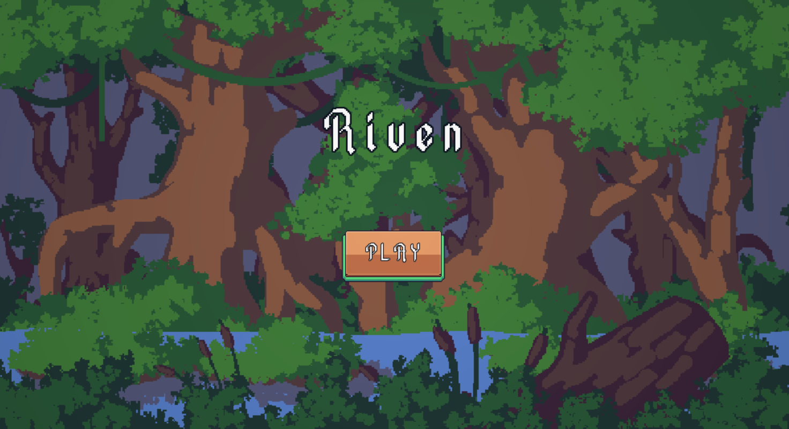
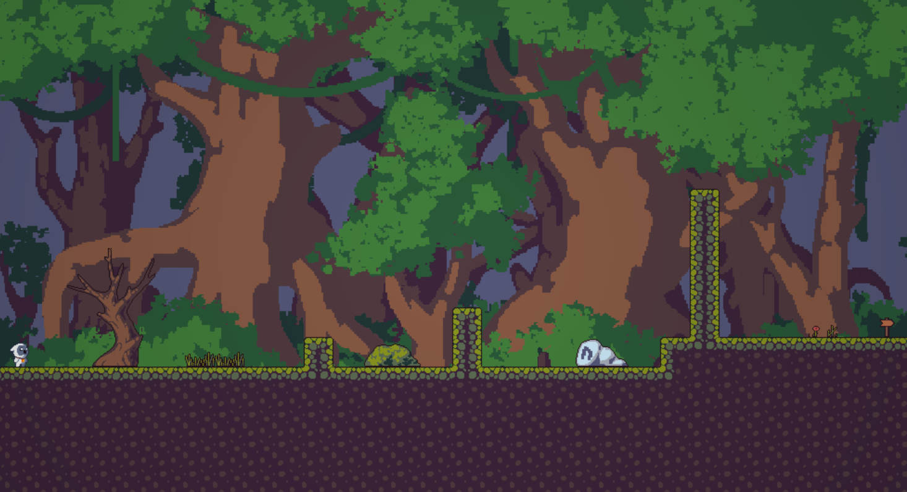
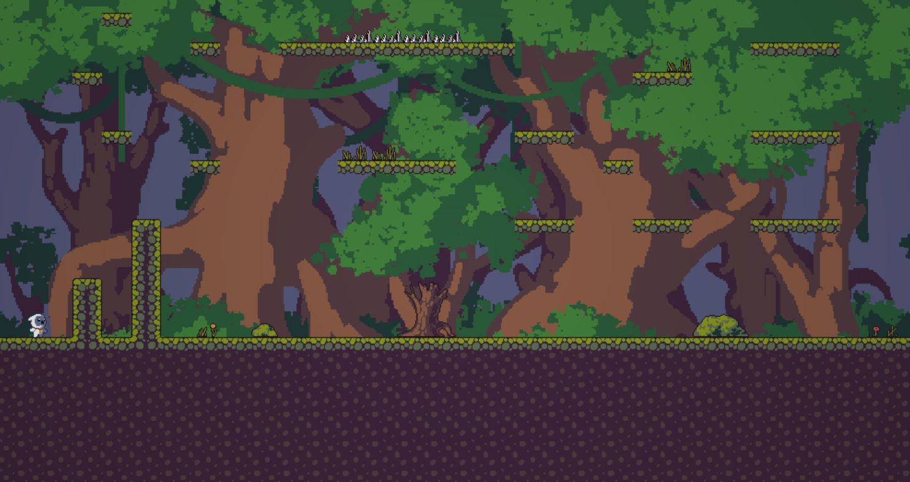

## Riven
#### *Platformer game with a Twist for Winter MelonJam 2024*


### Description 📚
Riven is a 2D pixel-art platformer that challenges players to discern the illusions of the mind from reality. Help your character overcome trials and achieve clarity at the end of his journey
<br><br>
*A young soul awakens in an endless forest, its mind fractured by a past that they can't remember.
In search of something precious, it wanders through the deep forest... But with every step, voices whisper, trees shift, and objects transform—some real, some imagined*






### GameJam Theme 🕹️
The word 'polarity' often refers to the concept of opposites or contrasting elements. Riven fits this theme perfectly since it revolves around telling illusions apart from reality - two opposing states of mind


### Features 💡
- Built-in level creation tool for more efficient workflow
- Visual hints for the player to spot fake objects


### Installation 🛠️

```
pip install pyinstaller
pyinstaller --noconfirm --onefile --windowed "[absolute path to the project]\Winter-MelonJam-2024\main.py"
// check dist directory inside project folder
// find .exe file
```


### Team 👨‍💻
- [Caleb](https://github.com/orangasus) - *Team Lead, Coder*
- [Radu](https://github.com/Styro457) - *Lead Programmer, Artist*
- [Sultan](https://github.com/Sultan-Alshehry) - *Level Designer, Coder*
- [Wyatt](https://github.com/wyat1t) - *Coder, Sound Designer*


### Acknoledgments 🎉
We are grateful to all [artists](./attributions.md) whose assets were used in our game!
